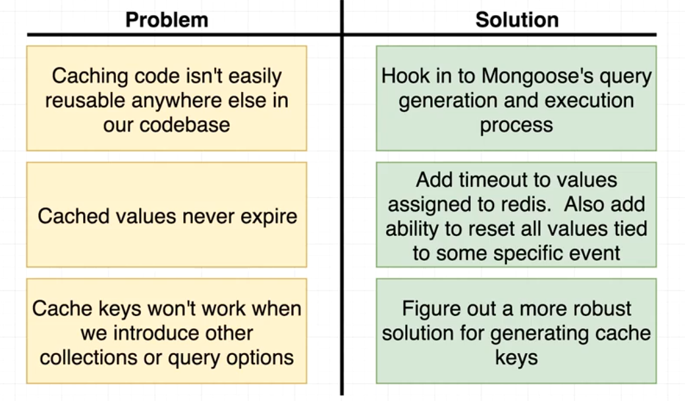
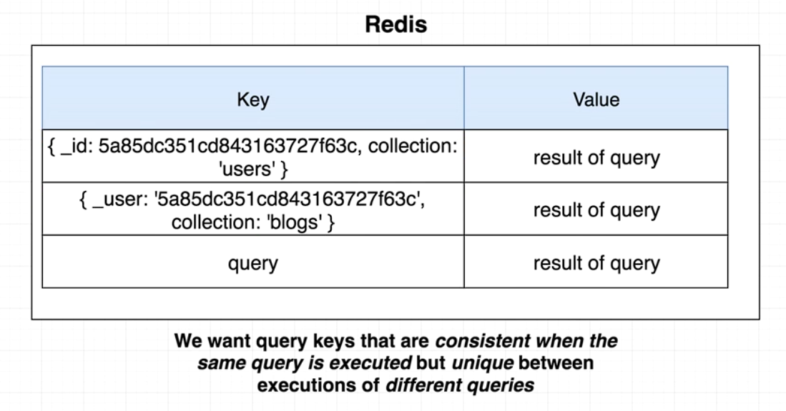

# AdvancedNodeStarter

Starting project for a course on Advanced Node @ Udemy

### Data caching (Redis)

Commom problems and possible solutions:

Logic of Key name:

Cache logic:

- Save cache with specific ID (user ID), check if has ID before query the Database
  - Need to overwrite default methods in database tool usage (mongoose -> mongoDB)
- Toggleable database cache (.cache() in method) w/ dynamic key (options object in cache parameters)
- Clear cache (to a specific user) after add new post
